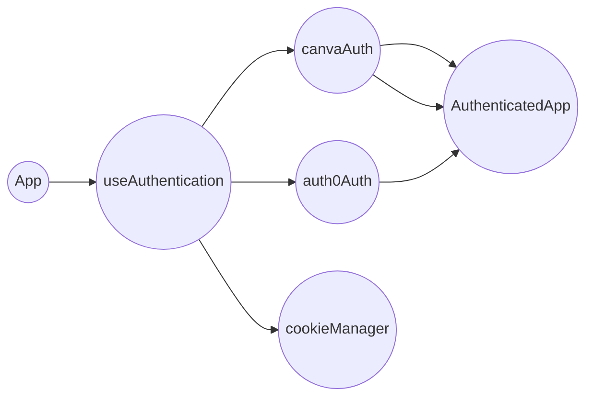
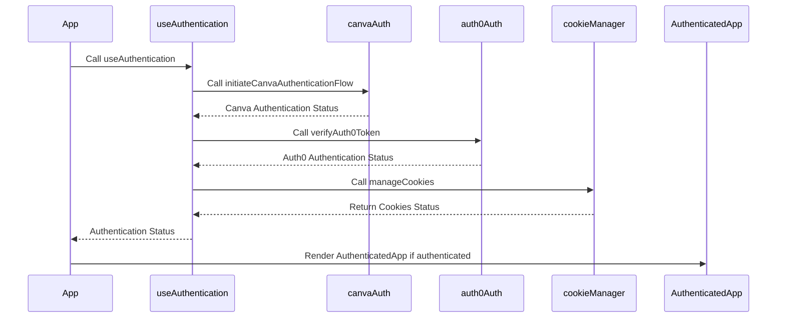
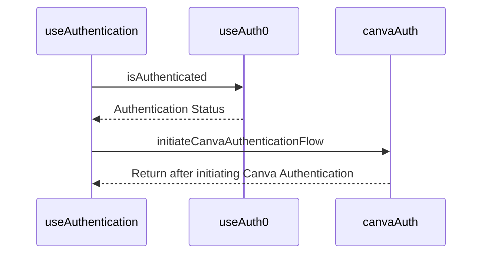
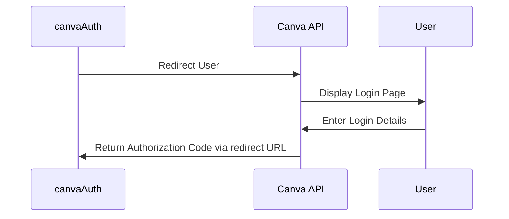
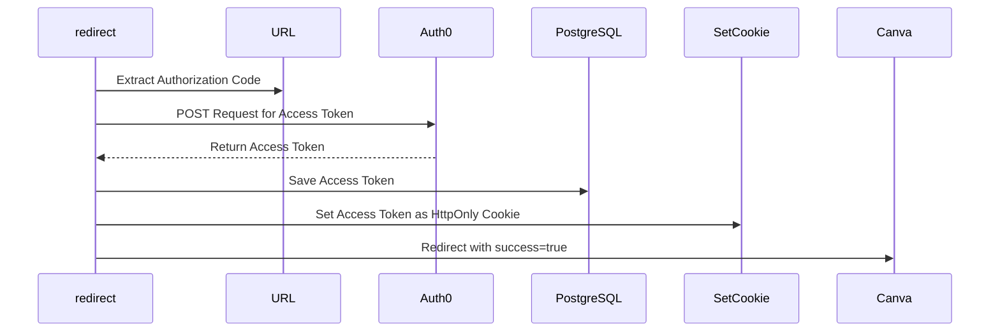
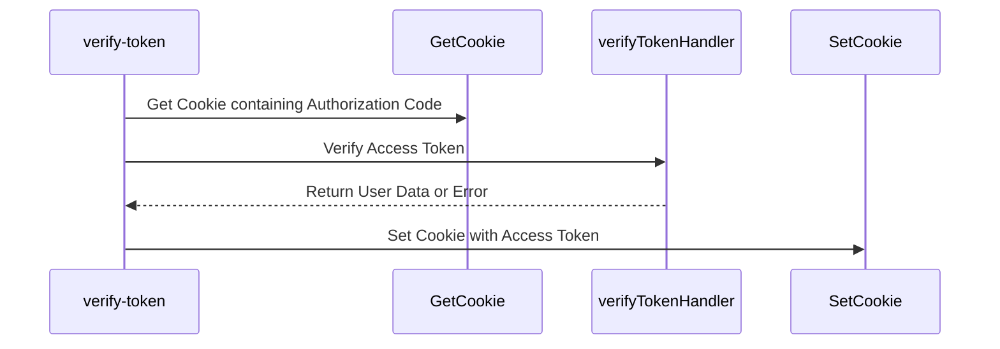
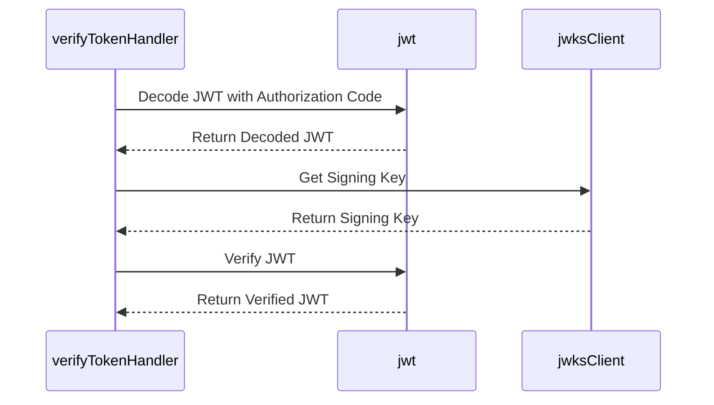
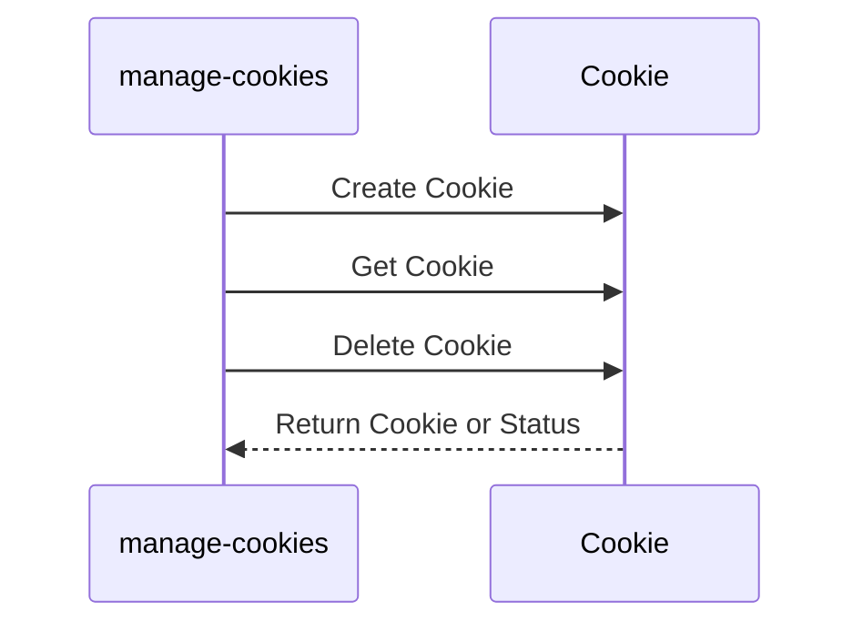
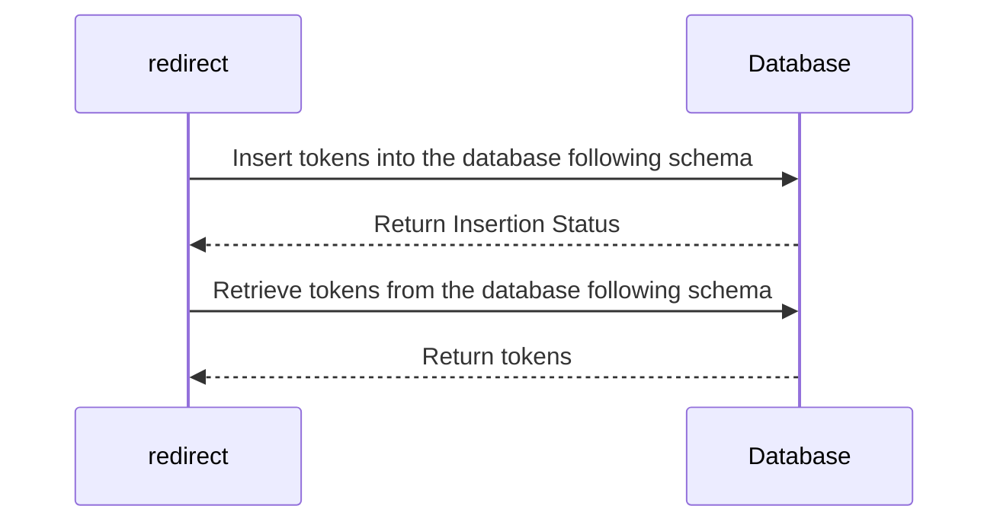

# Redesigned Authentication Flow in NFT App

In this revised design document, we delve into the redesigned authentication flow for our NFT App. This flow utilizes both Canva and Auth0 authentication services to provide a secure and reliable sign-in experience. Here's a step-by-step breakdown of the components and cloud functions involved in the system:

## High-Level System Design 



## Functional Flow Design 



## Components 

### 1. Index.tsx

This is the entry point of our React app. It wraps the main `App` component with `Auth0Provider` and `AppUiProvider`.

### 2. App.tsx

`App.tsx` is the central hub of the authentication flow. It uses the `useAuthentication` hook to check the user's authentication status and start the authentication process for unauthenticated users.

### 3. useAuthentication.ts

`useAuthentication.ts` manages the authentication state. It initiates the Canva authentication flow and verifies the Auth0 token.

This hook is responsible for managing the authentication state and orchestrating the authentication flow using Canva and Auth0.



### 4. canvaAuth.ts

This module initiates the Canva authentication flow using the Canva API.
Upon successful authentication with Canva, instead of only receiving the authorization code, we now set a cookie containing this authorization code. The cookie is HttpOnly and Secure to prevent any client-side scripts from accessing it and to ensure it's transmitted over secure HTTPS.



### 5. auth0Auth.ts
In Auth0Auth, the cookie containing the authorization code is retrieved, and the authorization code is sent to Auth0 for verification. If the verification is successful, another cookie containing the access token and refresh token received from Auth0 is set.
`auth0Auth.ts` verifies the Auth0 token.

### 6. AuthenticatedApp.tsx

This component is rendered when the user is successfully authenticated.

### 7. CookieManager.tsx

This component is responsible for handling the cookies. It sets, gets, and deletes cookies based on the requirements of the Canva and Auth0 authentications.

## Cloud Functions 

### 1. redirect Cloud Function

This function is activated after the user logs into Canva and gets redirected back to our application.

> This function extracts the authorization code from the URL, and sends a POST request to Auth0 to exchange the authorization code for an access and refresh token. 

> Once the tokens are received, they are saved in a PostgreSQL database for future use and set as HttpOnly cookies to the user's browser. The function then redirects the user back to Canva with the original state and success=true.




> The code for setting the cookie could look like this:
<pre>
```
const accessToken = "access_token_from_auth0";
res.cookie('token', accessToken, { httpOnly: true, secure: true });
```
</pre>

### 2. verify-token Cloud Function

`verify-token` validates the Auth0 access tokens.
It also checks for a token from the user's cookies.

>This function reads the authorization code from the HttpOnly cookie set by the Redirect function. If the token is verified successfully, it sets another HttpOnly, Secure cookie containing the access token and refresh token received from Auth0.

> This function uses the `verifyTokenHandler` module which checks the token, gets the user record from the database, and fetches user data from Auth0.

> If the token is expired, it calls `handleTokenExpiredError` which uses the refresh token to obtain a new access token from Auth0. The new access token is then saved to the database.

> The  code for extracting the token from the cookies could look like this:
<pre>
```
const token = req.cookies.token;
```
</pre>

### 3. verifyTokenHandler

This module verifies Auth0 tokens. If the token has expired, the `handleTokenExpiredError` function is called to manage the token refreshing process.

> It first decodes the token using `jwt.decode()` to get the `kid` (Key ID). 

> Then, it uses `jwksClient.getSigningKey()` to retrieve the corresponding public key. Using this public key, it verifies the JWT using `jwt.verify()`. 

> If the token is expired, it calls `handleTokenExpiredError` function which manages the token refreshing process.


### 4. manage-cookies Cloud Function
This function handles cookies for the authentication process. It creates cookies containing sensitive data (Authorization code, Access Token) and makes them HttpOnly and Secure to ensure they're transmitted over HTTPS and not accessible by client-side scripts. It also gets cookies when required for the authentication process, and deletes them when they are no longer needed.



## Schema Integration

We ensure the schema is used at each point where we interact with the PostgreSQL database. When we receive tokens from Auth0, we insert them into the database following the schema structure. When we retrieve tokens from the database, we also follow the schema.

> After the 'redirect' cloud function receives tokens from Auth0, it inserts these tokens into the database following the schema (i.e., each token is stored in the corresponding field defined by the schema).

> The database returns a status indicating whether the insertion was successful.

> Later, when tokens need to be retrieved, the 'redirect' function requests these tokens from the database according to the schema (i.e., it asks for data from specific fields defined by the schema).

> The database then returns the requested tokens.


This is a simplified diagram. In practice, the process of managing tokens in a database includes additional steps and procedures to ensure data integrity and security. For example, the tokens could be encrypted before being stored in the database, and there could be checks to handle any errors that occur during the process.
## Enhancements and Remarks

This newly designed authentication flow is expected to deliver a more secure and robust user experience. However, it's important to continually revisit and improve this design to cope with the rapidly evolving technological landscape. Specific areas that we should focus on include:

1. **Token Management**: Ensure secure storage and management of tokens.

2. **Scalability**: The authentication flow must cater to an increasing number of users.

3. **Error Handling**: Implement comprehensive error handling strategies to effectively manage potential errors or exceptions.

4. **User Experience**: Maintain a simple and intuitive authentication process to ensure a positive user experience.

5. **Cookie Management**: Consider using SameSite attribute to prevent CSRF attacks, and also ensure that we are GDPR-compliant in handling cookies.

6. **Revocation Strategy**: Develop a strategy to revoke cookies when they are no longer needed or when suspicious activity is detected.

7. **Token Refresh Mechanism**: For long-living applications, consider a token refresh mechanism to ensure that the user does not need to log in again.

8. **Monitor and Improve**: Monitor the authentication process for any potential issues or room for improvement, and continuously iterate and improve upon the system.